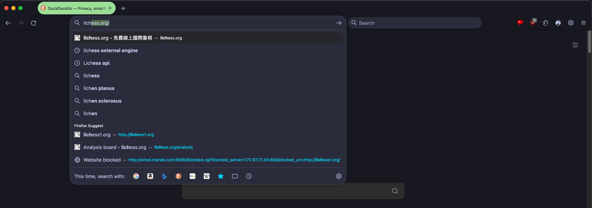

# foxppuccin

An **unfinished** Firefox skin based on the Catppuccin Mocha Green theme

(Yes I am aware that <a href="https://github.com/catppuccin/firefox">catppuccon/firefox</a> exists. But that's just a colour theme whereas this is a whole mod)


## Sample Image



## Installation

Note: Currently, these instructions only work on MacOS and Linux

First find your profile by going to <a href="https://support.mozilla.org/en-US/kb/profiles-where-firefox-stores-user-data#w_how-do-i-find-my-profile">https://support.mozilla.org/en-US/kb/profiles-where-firefox-stores-user-data#w_how-do-i-find-my-profile</a>

Then run: (Replace \<Your Profile> with the profile found above)
```zsh
cd <Your Profile>
git clone https://github.com/ACertainPersons/foxppuccin.git
mv foxppuccin chrome
```

## Contributions

Please send bug reports if found any
